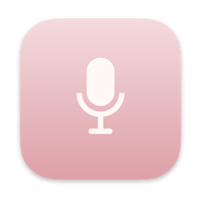

<p align="center">
  
</p>

<h1 align="center">BigYap for Mac</h1>

<p align="center">
  Private, on device voice to text.<br>
  Press a shortcut in any app, talk, and the words are pasted where you were typing.
</p>

<p align="center">
  <a href="https://bigyap.app/downloads/BigYap-1.0.dmg"><strong>Download for Mac</strong></a> ·
  <a href="https://bigyap.app">bigyap.app</a> ·
  <a href="https://bigyap.app/privacy">Privacy policy</a> ·
  <a href="LICENSE">MIT licence</a>
</p>

<p align="center">
  
  
  
  
</p>

---

## Why the source is public

BigYap's whole pitch is that nothing you say leaves your Mac. A claim like that is only
worth something if you can check it, so the code the app is built from lives here, in
full. Read it, build it, run it under a firewall. There is no hidden server, no
analytics and no account, and you do not have to take my word for it.

## What it does

- **Dictate into any app.** Press ⌥ Space (or a shortcut you choose), say the sentence,
  press it again. BigYap pastes the text into the field you were in. Mail, Slack, Xcode, a
  form in Safari. It does not matter.
- **Live transcription.** Words appear as you speak, and the final text lands the moment you
  stop. A standby speech session is kept warm so the shortcut feels instant.
- **Clean text, your words.** Three on device passes, each one a switch in Settings: trim
  silence, remove filler words (um, uh, you know, editable), and correct spelling against
  your own vocabulary (names, jargon, product names).
- **History.** Every transcript is saved locally with search, favourites, inline editing,
  undo delete and export as plain text.
- **Runs on any Mac with macOS 26.** It uses Apple's on device speech engine, not Apple
  Intelligence, so it does not need the newest hardware.

## Privacy, and how to check it

Every claim below points at the file that proves it.

| Claim | Where to look |
| --- | --- |
| **No network code.** The app never opens a connection. | `grep -rn "URLSession\|NWConnection\|import Network" bigyap/` returns nothing. No networking framework is imported anywhere. |
| **No third party code.** Every line the app runs is in this repository. | `bigyap.xcodeproj/project.pbxproj` has an empty `packageProductDependencies` list. There are no submodules, pods or vendored SDKs. |
| **Sandboxed.** The app can only reach the microphone and its own container. | [`bigyap/bigyap-macOS.entitlements`](bigyap/bigyap-macOS.entitlements): App Sandbox plus audio input, nothing else. No network client entitlement. |
| **Nothing collected.** | [`bigyap/PrivacyInfo.xcprivacy`](bigyap/PrivacyInfo.xcprivacy): no tracking, no collected data types, no tracking domains. |
| **Transcription happens on device.** | [`AppleSpeechTranscriberEngine.swift`](bigyap/Services/AppleSpeechTranscriberEngine.swift) and [`LiveTranscriptionSession.swift`](bigyap/Services/LiveTranscriptionSession.swift) drive Apple's `SpeechAnalyzer`, the same engine behind Notes and Voice Memos. |
| **Audio is never written to disk.** | [`AudioRecorder.swift`](bigyap/Services/AudioRecorder.swift) keeps samples in memory and hands them to the transcriber. Nothing is saved. |
| **Transcripts stay local.** | [`TranscriptEntry.swift`](bigyap/Models/TranscriptEntry.swift) is a SwiftData model stored in the app's own container. |
| **Accessibility is used for exactly one keystroke.** | [`SystemTextInjector.swift`](bigyap/Services/SystemTextInjector.swift) writes the pasteboard and posts a single ⌘V. It does not read, watch or log anything from other apps. Without the permission the text goes to your clipboard instead. |
| **The hot key needs no permission.** | [`GlobalHotKey.swift`](bigyap/Services/GlobalHotKey.swift) uses Carbon `RegisterEventHotKey`, which works inside the sandbox and never observes other keystrokes. |

**The one network event.** The first time you transcribe, macOS itself downloads Apple's
English speech model through `AssetInventory` (see `ensureModelInstalled()` in
[`AppleSpeechTranscriberEngine.swift`](bigyap/Services/AppleSpeechTranscriberEngine.swift)).
That request is made by the operating system to Apple, not by BigYap, and it happens once.
After that the app is fully offline.

### Checking a downloaded build

Install the app, then run these in Terminal:

```bash
# Who signed it, and is it notarised
codesign -dv --verbose=4 /Applications/BigYap.app
spctl --assess --type execute -v /Applications/BigYap.app

# The entitlements it actually shipped with (expect sandbox + audio input only)
codesign -d --entitlements - /Applications/BigYap.app
```

Then use it for a while with an outbound firewall such as Little Snitch or LuLu watching.
It never asks for a connection.

The strongest check is to build it yourself from this source and use that copy instead.

## Install

- **Download:** get the signed and notarised DMG from
  [bigyap.app](https://bigyap.app), or the direct link
  [BigYap-1.0.dmg](https://bigyap.app/downloads/BigYap-1.0.dmg). Open it and drag BigYap
  to Applications. The same file, with its SHA-256 checksum, is attached to each
  [GitHub release](../../releases).
- **Build it yourself:** see below.

On first launch macOS asks for the microphone. BigYap then explains the optional
Accessibility permission, which it needs only to paste. Decline it and the app still works,
with transcripts landing on the clipboard.

## Build from source

Requires **macOS 26** and **Xcode 26** (the app uses the `SpeechAnalyzer` API introduced
with them).

```bash
git clone https://github.com/James-Jelly/BigYap.git
cd BigYap
open bigyap.xcodeproj
```

Select your own team under *Signing & Capabilities* and press Run. To build from the
command line without a signing identity:

```bash
xcodebuild -project bigyap.xcodeproj -scheme bigyap \
  -destination 'platform=macOS,arch=arm64' CODE_SIGNING_ALLOWED=NO build
```

Run the logic tests, which compile the real processing sources with a set of assertions:

```bash
./Tests/run-tests.sh
```

Package a DMG (signs with Developer ID if you have one, otherwise ad hoc):

```bash
./Tools/make-dmg.sh
```

## How it works

```
bigyap/
  bigyapApp.swift                  App entry, SwiftData container, hot key controller
  ContentView.swift                Three tabs: Record · History · Settings
  Models/TranscriptEntry.swift     Saved transcript (text, date, source, favourite)
  Services/
    AudioRecorder.swift            AVAudioEngine capture, 16 kHz float samples in memory
    LiveTranscriptionSession.swift Streams audio into SpeechAnalyzer while you talk
    AppleSpeechTranscriberEngine.swift  One shot transcription, used for retries
    TranscriptFinalizer.swift      Cleanup pipeline, save to history, copy to clipboard
    TranscriptProcessor.swift      Vocabulary → fillers → tidy (pure, testable)
    FuzzyMatcher.swift             Levenshtein + Soundex for vocabulary correction
    VoiceActivityTrimmer.swift     Energy based silence trimming (Accelerate)
    GlobalHotKey.swift             Carbon hot key registration
    HotKeyDictationController.swift  The ⌥Space take: record, transcribe, paste
    SystemTextInjector.swift       Pasteboard write + one synthetic ⌘V
    DictationShortcut.swift        User configurable shortcut model
    AppSettings.swift              Toggles and lists, UserDefaults backed
    Platform.swift                 Every macOS / iOS difference, in one file
  Views/                           SwiftUI screens
  DesignSystem/                    Palette, spacing, type, shared components
```

**One recording pipeline, two entry points.** The Record tab button and the global
shortcut drive the same recorder, the same streaming session and the same finaliser. Only
one of them can hold the microphone at a time.

**The pure core is dependency free.** `TranscriptProcessor`, `FuzzyMatcher` and
`VoiceActivityTrimmer` import only Foundation and Accelerate, are `Sendable`, and are what
`Tests/run-tests.sh` exercises.

**One target, two platforms.** The same Xcode target also builds the iPhone version of
BigYap. Platform differences are kept to `Services/Platform.swift` and a handful of
`#if os(...)` blocks, so what you read here is exactly what ships on the Mac.

## Permissions it asks for

| Permission | Required | Why |
| --- | --- | --- |
| Microphone | Yes | To hear you. Audio stays in memory. |
| Accessibility | No | To paste the finished transcript into the app you are using. Without it the text is copied to the clipboard. |

Nothing else. No Full Disk Access, no Screen Recording, no Input Monitoring, no login item.

## Contributing

Issues and pull requests are welcome. The one rule: keep the privacy boundary intact. No
network code, no analytics, no third party dependencies, no extra entitlements. Changes
that touch the processing pipeline should come with an assertion in `Tests/main.swift`.

## Licence

[MIT](LICENSE). © 2026 James Jelly.
